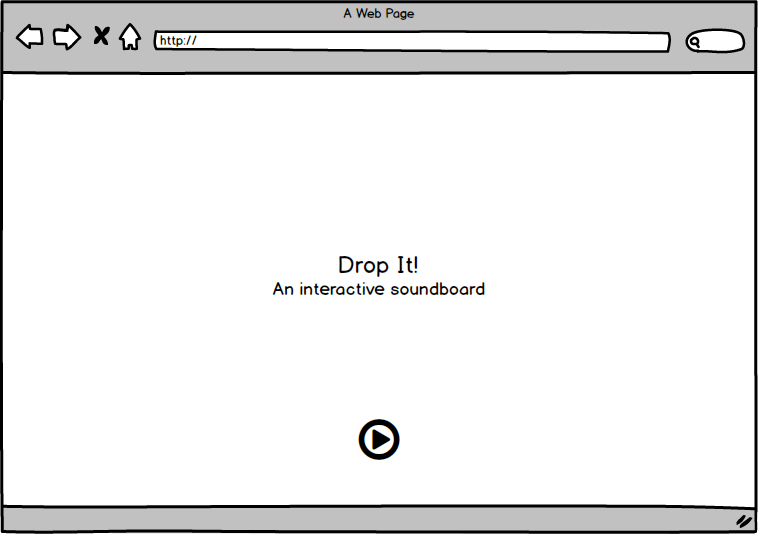
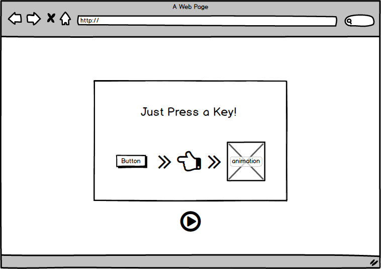

# 1010

## Background
DropIt is an interactive soundboard filled with awesome sample sounds for users to create beats.

## Functionality and MVP
With DropIt, users will be allowed to
- [ ] Play sounds with their keyboard

This project will also include:
- [ ] An about modal with instructions and screenshots of play
- [ ] Animation effects each time a key is pressed
- [ ] A production README

## Wireframe
This app consists of a single screen with animations and a modal for instructions. Links to my github and linkedin will also be available on the bottom of the page. Game controls will include switching sound/color sets.

## Architecture and Technologies
This project will be implemented with the following technologies:
* Vanilla Javascript will handle the overall logic in creating the webpage.
* React will setup the modal for the user.
* HTML5 and Canvas will be used for DOM manipulation and rendering.
* Howler.js will play audio sounds in the library.
* AnimeJS will animate the canvas drawings.
* Animate.css will animate the text and logo.
* Webpack will bundle the scripts.
* Babel will transpile ES6 to ES5.

## Implementation Timeline

### Day 1
Complete frontend structure
* Configure webpack
* Write Sounds class

### Day 2 & 3
Learning javascript libraries
* Style page with HTML5 and CSS3 to be presentable
* Learn howler.js to play sounds when key is pressed
* Render animations for sounds

### Day 4
Touchup
* Make modal for instructions and sample play
* Style frontend to have everything presentable

### Bonus features
- [ ] Ability to save tunes
- [ ] Share tunes with friends
